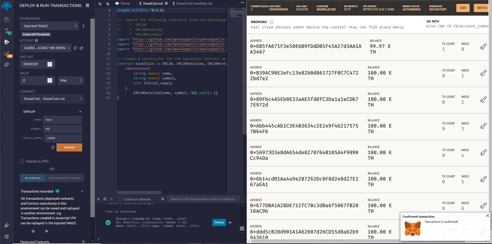
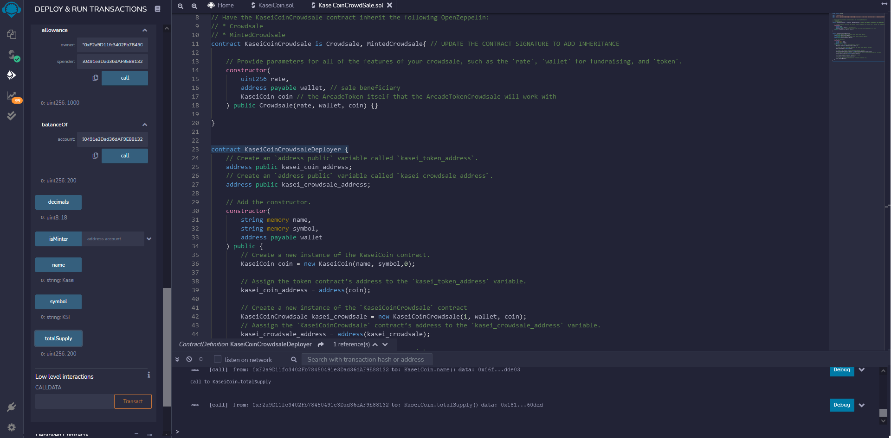
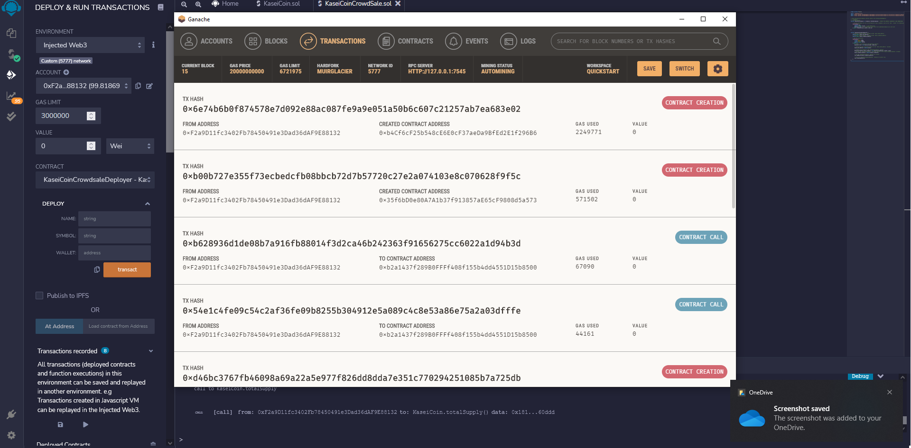
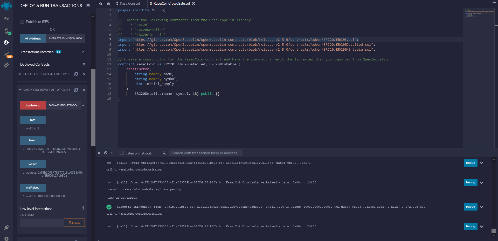

# Tokens
in this project we use solidity to deploy smart contracts with remix ide, ganache and metamask
# Screenshots
To run the code, deploy the deployer contract, and use the respective adress calls to deploy the coin and crowdshare contracts.
Below are the screenshots of successful compling for each of the provided files

Below is the inital deployment

Below are some balances

Below are some transactions

Lastly, the raised wei from the crowdfunding

