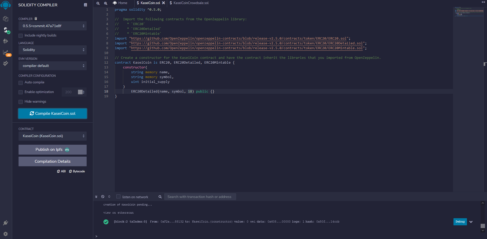
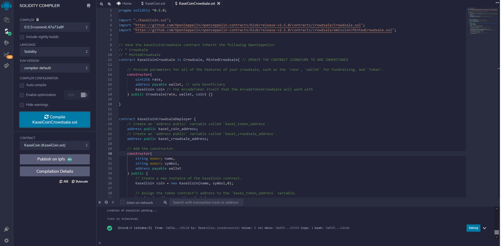

# Tokens
in this project we use solidity to deploy smart contracts with remix ide, ganache and metamask
# Screenshots
To run the code, run the deployer contract, and use the respective adress calls for the coin and crowdshare contracts.
Below are the screenshots of successful compling for each of the provided files

